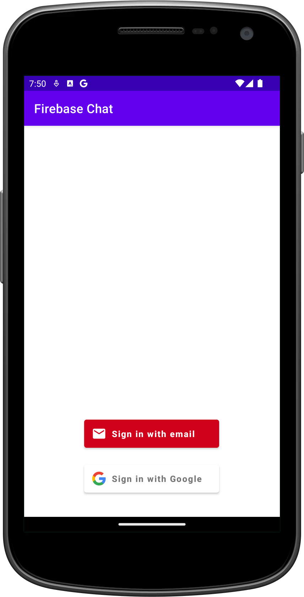
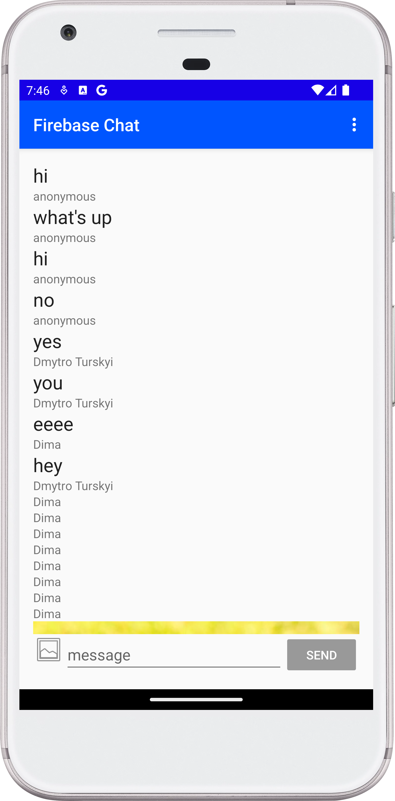

[](https://stand-with-ukraine.pp.ua)


# FirebaseChat

FirebaseChat is a sample Android app designed for educational purposes. It
demonstrates the basics of implementing a chat application using Firebase. The
app includes a login screen with email and Google authentication, and a fully
functional chat screen where users can send messages and images.

## Features

- **Login Screen**: Users can log in via email or Google.
- **Chat Screen**: Users can interact with others in the chat, send messages,
  and share images.
- **Educational Value**: The main value of this project is the code, which
  developers can explore to understand how to implement chat functionality with
  Firebase.

## Getting Started

To run this project locally, you need to have Android Studio installed on your
machine. Follow these steps:

- Clone the repository:

```bash
git clone https://github.com/Turskyi/FirebaseChat.git
```

- Open the project in Android Studio.
- Build and run the project on an emulator or physical device.

## Usage

This app is intended for educational purposes. It allows users to see how a
chat application works with Firebase. The main usage is to copy and paste the
code for projects where similar functionality is needed.

## Technologies Used

* Operating System: Android
* Programming Language: Kotlin
*

Architecture: [Monolith](https://en.wikipedia.org/wiki/Monolithic_architecture)

* Firebase Services:
    - com.google.android.gms:play-services-auth
    - com.github.bumptech.glide:glide
    - com.google.firebase:firebase-database-ktx
    - com.firebaseui:firebase-ui-auth
    - com.google.firebase:firebase-auth-ktx
    - com.google.firebase:firebase-messaging
    - com.google.firebase:firebase-storage-ktx
    - com.google.firebase:firebase-config-ktx
    - com.google.android.gms:play-services-basement

## Contributing

Contributions are welcome! If you would like to contribute, please create a
pull request in the “master” branch.

## License

This project does not have an intentional license.

## Inspiration

This project was inspired by the
[Firebase in a Weekend by Google](https://www.udacity.com/course/firebase-in-a-weekend-by-google-android--ud0352):
Android tutorial on Udacity and the
[and-nd-firebase](https://github.com/udacity/and-nd-firebase/tree/2.05-firebase-remote-config-fetch)
repository by [Udacity](https://github.com/udacity).

## Screenshots:

<!--suppress CheckImageSize -->

<!--suppress CheckImageSize -->
